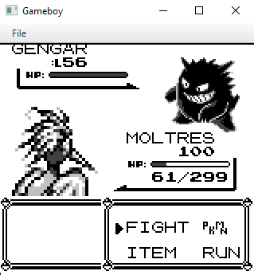
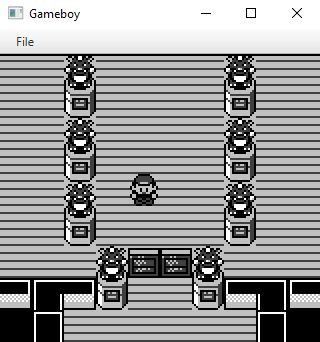
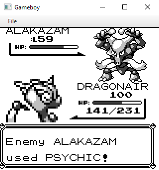
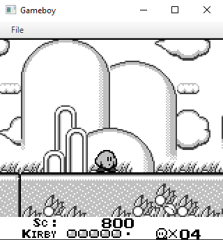
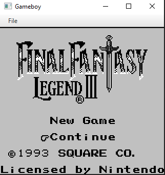
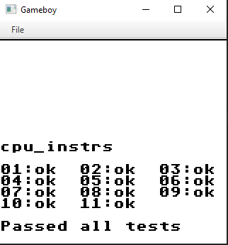
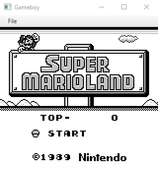

# gBoy

[](https://travis-ci.org/gregei/gBoy)

Gameboy emulator written in native Java, built using maven.
The goal was to test my reverse engineering skills, software engineering skills, and to push Java.



# Building and running :hammer:
Build with maven command:
```
mvn clean compile package
```
The runnable jar will be in the directory `/target`

Ran by double-clicking or with command:
```
java -jar gboy-1.0-SNAPSHOT.jar
```

# Features :thumbsup:
- Full GMB emulation
- Fully implemented Z80 instruction set
- Fully implemented GMB LCD
- Cartridge mappers MBC1, MBC3, and MBC5
- Semi implemented serial cable
- GUI and file opener

# Joypad :video_game:
| Original | Keyboard |
|----------|---------------------|
| Down     |  Down Key           |
| Up       | Up Key              |
| Left     | Left Key            |
| Right    | Right Key           |
| Start    | Z                   |
| Select   | X                   |
| B        | A                   |
| A        | S                   |
| L        | Start, Select, B, A | 


# Todo :date:
- Implement sound
- Check CPU cycle accuracy
- Implement all cartridge save mappers
- Fix game edge cases
- Implement CGB

# Screenshots :camera:








# Resources :book:
- https://www.zilog.com/manage_directlink.php?filepath=docs/z80/um0080&extn=.pdf - Z80 CPU Manual
- http://pastraiser.com/cpu/gameboy/gameboy_opcodes.html - GameBoy Opcode Documentation
- http://www.myquest.nl/z80undocumented/z80cpu_um.pdf - Z80 Documentation
- http://gameboy.mongenel.com/dmg/opcodes.html - GameBoy Opcode Documentation
- https://gbdev.gg8.se/files/roms/blargg-gb-tests/ - Blargg Test Roms
- http://bgb.bircd.org/pandocs.htm - GameBoy Documents
- http://www.codeslinger.co.uk - GameBoy Emulator Tutorial
- http://marc.rawer.de/Gameboy/Docs/GBCPUman.pdf - GameBoy Documentation
